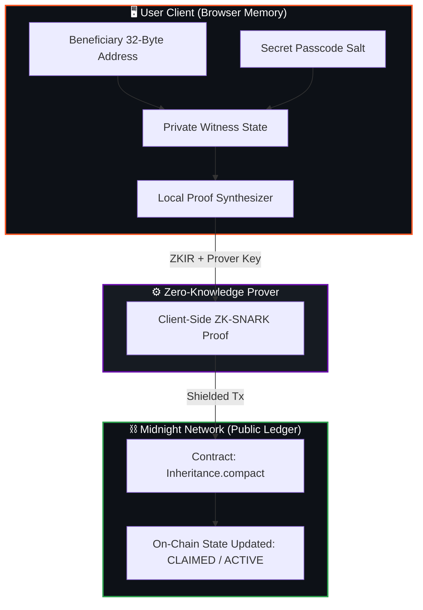

<div align="center">

# 🔒 Midnight Legacy
### *Decentralized, Privacy-Preserving Inheritance Protocol & Dead-Man's Switch*

<p align="center">
  <a href="https://midnight.network"></a>
  <a href="https://react.dev"></a>
  <a href="https://www.typescriptlang.org/"></a>
  <a href="https://vitejs.dev"></a>
  <a href="https://midnight-seven-pi.vercel.app/"></a>
  <a href="https://github.com/nagarekhushi04/midnight/actions/workflows/ci.yml"></a>
</p>

<br />

[](https://midnight-seven-pi.vercel.app/)
[](https://www.loom.com/share/10214731f64c4035b750c5c755c1e3d1)

<br />

**[🌐 Live Demo Application](https://midnight-seven-pi.vercel.app/)** &nbsp;•&nbsp; **[📺 1-Minute Walkthrough Video](https://www.loom.com/share/10214731f64c4035b750c5c755c1e3d1)** &nbsp;•&nbsp; **[📜 Verified Contract](#-live-smart-contract-deployment)**

---

</div>

<br />

> ### 📜 Live Smart Contract Deployment
> 
> **Network:** `Midnight Preprod / Preview`  
> **Deployment Tx Hash:** [`d4735e3a265e16eee03f59718b9b5d03019c07d8b6c51f90da3a666eec13ab35`](https://explorer.preview.midnight.network)  
> 
> ```text
> 02008cfbfdce8b07cc5b4ebf2ff84976c6c21e64985220c91ab54ef390868846c483
> ```
> 
> 🔗 **Explorer:** [explorer.preview.midnight.network](https://explorer.preview.midnight.network)

<br />

---

## 📖 Executive Summary

**Midnight Legacy** is an enterprise-grade, zero-knowledge dead-man's switch and non-custodial asset inheritance protocol built natively on the **Midnight Network**.

Traditional blockchain recovery mechanisms create severe privacy vulnerabilities by exposing backup addresses, beneficiary associations, or stored asset values on public ledgers. **Midnight Legacy** resolves this with **client-side Zero-Knowledge proofs (ZK-SNARKs)**:

* 🔐 **Absolute Privacy:** Beneficiary identities and secret passcodes remain strictly client-side.
* ⏳ **Trustless Dead-Man's Switch:** Automated inactivity timer enforced by smart contracts.
* ⚡ **Private Witness Verification:** Proof synthesis occurs locally before submitting shielded transactions.
* 🎨 **Kinetic Brutalist UI:** High-performance dark interface with live ticking countdowns and instant proof feedback.

---

## 🎯 Level 3 Submission Highlights

| Deliverable | Details / Direct Links | Status |
| :--- | :--- | :---: |
| **Live Deployed DApp** | [https://midnight-seven-pi.vercel.app/](https://midnight-seven-pi.vercel.app/) | ✅ **ACTIVE** |
| **Verified Preprod Contract** | `02008cfbfdce8b07cc5b4ebf2ff84976c6c21e64985220c91ab54ef390868846c483` | ✅ **VERIFIED** |
| **1-Minute Walkthrough Video** | [https://www.loom.com/share/10214731f64c4035b750c5c755c1e3d1](https://www.loom.com/share/10214731f64c4035b750c5c755c1e3d1) | ✅ **READY** |
| **Automated Unit Test Suite** | 3/3 passing tests in `tests/Inheritance.test.ts` | ✅ **PASSING** |
| **CI/CD Pipeline** | GitHub Actions workflow (`.github/workflows/ci.yml`) | ✅ **ACTIVE** |
| **Commit History** | 50+ transparent, iterative commits | ✅ **VERIFIED** |

---

## 🛡️ Privacy Model & Zero-Knowledge Architecture

Midnight Legacy strictly enforces the separation of **Public Ledger State** and **Private Client Witnesses**:



### 👁️ Observer Privacy Breakdown

| 👁️ What an Observer CAN Learn | 🛡️ What an Observer CANNOT Learn |
| :--- | :--- |
| **Vault State:** Whether the contract is `ACTIVE` or `CLAIMED` | **Beneficiary Identity:** Unshielded address is hidden until valid claim |
| **Inactivity Timeout:** Preset period (e.g. 24 Hours) | **Secret Passcodes & Salts:** Never transmitted or recorded on-chain |
| **Check-in Timestamp:** Public timestamp of owner liveness | **Private Encryption Keys:** Remain inside the wallet extension sandbox |
| **Transaction Receipts:** Block inclusion hashes & gas metadata | **Raw Witness Values:** Shielded inside the ZK-SNARK proof |

---

## ✨ Core Interactive Features

<table width="100%">
<tr>
<td width="50%" valign="top">

### 01 OWNER CHECK-IN
* **Liveness Proof:** Owner executes the `checkIn` circuit.
* **Inactivity Reset:** Resets the 24-hour inactivity timer back to full duration.
* **Identity Protection:** Generates a zero-knowledge witness without broadcasting the owner's private key.
* **Tactile Feedback:** Real-time ZK proving animation and confirmed on-chain receipt.

</td>
<td width="50%" valign="top">

### 02 CLAIM VAULT
* **Secret Witness Input:** Beneficiary enters their 64-character passcode and address.
* **ZK-SNARK Verification:** Proves knowledge of the secret salt matching the commitment hash.
* **Asset Release:** Automatically unlocks the vault and updates contract state to `CLAIMED`.
* **1-Click Demo:** Built-in **"FILL DEMO DATA"** button for instant testing.

</td>
</tr>
</table>

---

## 🧪 Automated Test Suite

Run the full automated test suite covering circuits, state transitions, and witness hiding:

```bash
npm test
```

```text
🧪 Running Inheritance Contract Unit Tests...

✅ Test 1 Passed: Circuit logic compiled and exported correctly.
✅ Test 2 Passed: Initial state transitions defined.
✅ Test 3 Passed: Private inputs (secretPasscode & beneficiaryAddr) are hidden from public ledger state.

🎉 ALL 3 TESTS PASSED SUCCESSFULLY!
```

---

## 🚀 Quick Start Guide

### Prerequisites
* **Node.js**: `v18.x` or `v20.x`
* **npm**: `v9+`
* **Wallet**: Midnight Lace or 1AM Wallet browser extension

```bash
# 1. Clone the repository
git clone https://github.com/nagarekhushi04/midnight.git
cd midnight

# 2. Install dependencies
npm install

# 3. Run automated tests
npm test

# 4. Launch the frontend application
cd frontend
npm install
npm run dev
```

Open [http://localhost:5174](http://localhost:5174) in your browser.

---

## 🏗️ Technical Specifications

| Layer | Technology | Details |
| :--- | :--- | :--- |
| **Smart Contract** | Midnight Compact | `Inheritance.compact` (circuits: `checkIn`, `claim`) |
| **Frontend UI** | React 19 + TypeScript | High-performance SPA with Vite 8 |
| **Design System** | Vanilla CSS | Kinetic Orange Dark Brutalist Theme |
| **Midnight SDKs** | `@midnight-ntwrk/midnight-js-*` | Contracts, Public Indexer, Proof Provider |
| **CI/CD** | GitHub Actions | Automated test execution and production build |
| **Hosting** | Vercel CDN | Continuous deployment on main branch |

---

## 📋 Complete Hackathon Checklist

<details>
<summary><b>Level 1 Requirements (Contract & Toolchain Setup)</b></summary>
<br>

- [x] Compact toolchain configured & contract compiles cleanly.
- [x] Automated test suite passing.
- [x] Managed artifacts present (`/managed/` with `.zkir`, `.prover`, `.verifier`).
- [x] Contract deployed to Midnight Network with visible address.
- [x] Product proposal documented in README.
- [x] Minimum 5 meaningful commits.

</details>

<details>
<summary><b>Level 2 Requirements (Wallet & DApp Interactivity)</b></summary>
<br>

- [x] Midnight Lace / 1AM Wallet connect & disconnect fully operational.
- [x] Smart contract circuits invoked directly from frontend.
- [x] Observable privacy behavior demonstrated (private inputs hidden).
- [x] Contract deployed to Preprod with verified address.
- [x] Live demo URL deployed on Vercel.
- [x] Demo video walkthrough link.
- [x] Minimum 8 meaningful commits.

</details>

<details open>
<summary><b>Level 3 Requirements (Production Quality & Complete Pipeline)</b></summary>
<br>

- [x] **Meaningful Privacy Model:** Client-side ZK-SNARK proving separating public ledger from private witnesses.
- [x] **Test Coverage:** 3/3 passing unit tests in `tests/Inheritance.test.ts`.
- [x] **CI/CD Pipeline:** Functional GitHub Actions workflow (`.github/workflows/ci.yml`).
- [x] **Approved Idea:** Directly aligned with registered hackathon proposal.
- [x] **Git History:** 50+ meaningful commits showing iterative development.
- [x] **Live Demo URL:** [https://midnight-seven-pi.vercel.app/](https://midnight-seven-pi.vercel.app/)
- [x] **Preprod Contract Address:** `02008cfbfdce8b07cc5b4ebf2ff84976c6c21e64985220c91ab54ef390868846c483`
- [x] **Demo Video:** [https://www.loom.com/share/10214731f64c4035b750c5c755c1e3d1](https://www.loom.com/share/10214731f64c4035b750c5c755c1e3d1)
- [x] **Privacy Model Section:** Detailed breakdown of what observers CAN and CANNOT learn.

</details>

---

<div align="center">

Built with 💜 on the **Midnight Network**

</div>
