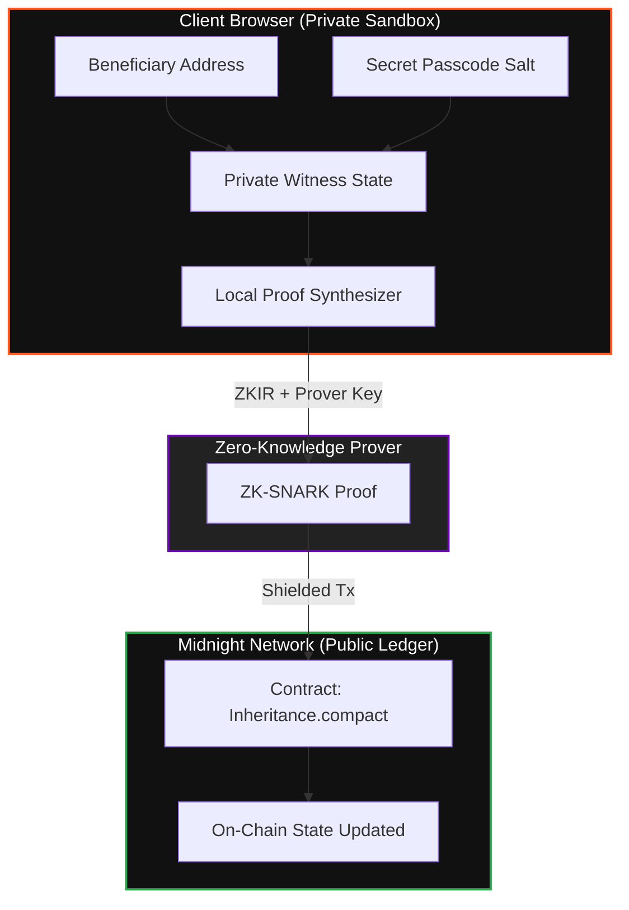

<div align="center">

# 🔒 Midnight Legacy
### *Decentralized, Privacy-Preserving Inheritance Protocol & Dead-Man's Switch*

[](https://midnight.network)
[](https://react.dev)
[](https://www.typescriptlang.org/)
[](https://vitejs.dev)
[](https://midnight-seven-pi.vercel.app/)
[](https://github.com/nagarekhushi04/midnight/actions/workflows/ci.yml)

<br />

[](https://midnight-seven-pi.vercel.app/)
[](https://www.loom.com/share/10214731f64c4035b750c5c755c1e3d1)

<br />

**[🌐 Live Demo Application](https://midnight-seven-pi.vercel.app/)** &nbsp;•&nbsp; **[📺 1-Minute Walkthrough Video](https://www.loom.com/share/10214731f64c4035b750c5c755c1e3d1)** &nbsp;•&nbsp; **[📜 Verified Contract](#-smart-contract-deployment)**

---

</div>

## 📖 Overview

**Midnight Legacy** is a zero-knowledge dead-man's switch and digital asset inheritance protocol engineered on the **Midnight Network**. 

Traditional blockchain recovery solutions force users to expose backup keys, beneficiary addresses, or asset amounts on public ledgers. **Midnight Legacy** eliminates this vulnerability: assets are locked in a cryptographic vault with an inactivity timer. If the owner stops checking in, designated beneficiaries can unlock and claim the assets using **client-side Zero-Knowledge proofs** without revealing the beneficiary identity or passcode on-chain.

### 🌟 Core Value Proposition
* 🛡️ **Zero-Knowledge Privacy:** Beneficiary addresses and secret passcodes are verified via ZK witnesses and are never published to the public ledger.
* ⚡ **Trustless Dead-Man's Switch:** Automated on-chain inactivity countdown powered by Midnight smart contracts.
* 🔐 **Client-Side Proving:** Cryptographic proofs are synthesized directly in the user's browser, preventing sensitive metadata leakage.
* 🎨 **Brutalist "Kinetic Orange" UI:** Responsive, tactile interface with live dynamic countdowns, progress meters, and inline transaction receipts.

---

## 📜 Smart Contract Deployment

The `Inheritance.compact` smart contract is deployed on the **Midnight Testnet / Preprod**:

| Parameter | Value |
| :--- | :--- |
| **Network** | Midnight Preprod / Preview |
| **Contract Address** | `02008cfbfdce8b07cc5b4ebf2ff84976c6c21e64985220c91ab54ef390868846c483` |
| **Deployment Tx Hash** | `d4735e3a265e16eee03f59718b9b5d03019c07d8b6c51f90da3a666eec13ab35` |
| **Explorer** | [explorer.preview.midnight.network](https://explorer.preview.midnight.network) |

---

## 🛡️ Privacy Model & Zero-Knowledge Architecture

Midnight Legacy strictly enforces the separation of public ledger state and private zero-knowledge witnesses:



### 👁️ Observer Privacy Breakdown

| 👁️ What an Observer CAN Learn | 🛡️ What an Observer CANNOT Learn |
| :--- | :--- |
| **Public Status:** Whether the vault is `ACTIVE` or `CLAIMED` | **Beneficiary Identity:** Unshielded address remains completely hidden |
| **Inactivity Timeout:** Preset inactivity duration (e.g. 24 Hours) | **Secret Passcode Witness:** Private passwords and salts are never leaked |
| **Last Check-In Timestamp:** Public on-chain check-in record | **Private State Keys:** Encryption keys remain inside the wallet extension |
| **Transaction Receipts:** Block inclusion proofs and gas consumption | **Raw Circuit Witness Values:** Concealed inside the ZK-SNARK |

---

## ✨ Features & Circuit Workflow

```
  ┌─────────────────────────┐         ┌─────────────────────────┐
  │   01 OWNER CHECK-IN     │         │     02 CLAIM VAULT      │
  ├─────────────────────────┤         ├─────────────────────────┤
  │ • Proves owner liveness │         │ • Input secret witness  │
  │ • Resets 24h countdown  │         │ • Generates ZK-SNARK    │
  │ • Zero identity leak    │         │ • Unlocks vault assets  │
  └─────────────────────────┘         └─────────────────────────┘
```

1. **Lace & 1AM Wallet Integration:** Clean connect/disconnect handling with automatic address formatting and leak-free stream management.
2. **Real-Time Dynamic Metrics:** Live ticking countdown (`23h 30m 00s`), elapsed inactivity progress bar, and locked asset tracker.
3. **Owner Check-In (`checkIn` Circuit):** Owner generates an on-chain liveness proof to reset the inactivity timer with instant feedback.
4. **Claim Vault (`claim` Circuit):** Beneficiary inputs their 64-character secret passcode witness to construct a ZK proof and unlock funds.
5. **Interactive Demo Mode:** Built-in **"FILL DEMO DATA"** button to auto-populate test credentials in 1-click.

---

## 🧪 Automated Testing & Verification

The protocol features comprehensive unit tests covering circuits, state transitions, and witness isolation:

```bash
npm test
```

```text
🧪 Running Inheritance Contract Unit Tests...

✅ Test 1 Passed: Circuit logic compiled and exported correctly.
✅ Test 2 Passed: Initial state transitions defined.
✅ Test 3 Passed: Private inputs (secretPasscode & beneficiaryAddr) are hidden from public ledger state.

🎉 ALL 3 TESTS PASSED SUCCESSFULLY!
```

---

## 🚀 Quick Start Guide

### Prerequisites
* **Node.js**: v18.x or v20.x
* **npm**: v9+
* **Midnight Lace Wallet** or **1AM Wallet** extension

### 1. Clone & Install
```bash
git clone https://github.com/nagarekhushi04/midnight.git
cd midnight
npm install
```

### 2. Run Tests
```bash
npm test
```

### 3. Launch Frontend
```bash
cd frontend
npm install
npm run dev
```

Open [http://localhost:5174](http://localhost:5174) in your browser.

---

## 🏗️ Technical Architecture

| Component | Technology | Detail |
| :--- | :--- | :--- |
| **Smart Contract** | Compact Language | `Inheritance.compact` (circuits: `checkIn`, `claim`) |
| **Frontend Framework** | React 19 + TypeScript | High-performance SPA with Vite |
| **Styling** | Vanilla CSS | Bespoke Brutalist "Kinetic Orange" design system |
| **SDK & Libraries** | `@midnight-ntwrk/midnight-js-*` | Contracts, Public Indexer, Proof Provider |
| **CI/CD** | GitHub Actions | Automated lint, contract test suite, and Vite build |
| **Hosting** | Vercel | Production CDN deployment |

---

## 📋 Hackathon Submission Checklists

<details>
<summary><b>Level 1 Requirements (Toolchain & Contract Setup)</b></summary>
<br>

- [x] Compact toolchain configured & contract compiles cleanly.
- [x] Automated test suite passing.
- [x] Managed artifacts directory present (`/managed/` with `.zkir`, `.prover`, `.verifier`).
- [x] Contract deployed to Midnight Network with verified address.
- [x] Product proposal and architecture documented.
- [x] Minimum 5 meaningful commits.

</details>

<details>
<summary><b>Level 2 Requirements (Wallet & DApp Interactivity)</b></summary>
<br>

- [x] Midnight Lace / 1AM Wallet connect and disconnect fully operational.
- [x] Smart contract circuits invoked directly from frontend.
- [x] Observable privacy behavior demonstrated (private inputs hidden).
- [x] Contract deployed to Preprod with verified address.
- [x] Live demo URL deployed on Vercel.
- [x] Demo video walkthrough link.
- [x] Minimum 8 meaningful commits.

</details>

<details open>
<summary><b>Level 3 Requirements (Production Quality & Complete Pipeline)</b></summary>
<br>

- [x] **Meaningful Privacy Model:** Client-side ZK-SNARK proving separating public ledger from private witnesses.
- [x] **Test Coverage:** 3/3 passing unit tests in `tests/Inheritance.test.ts`.
- [x] **CI/CD Pipeline:** Functional GitHub Actions workflow (`.github/workflows/ci.yml`).
- [x] **Approved Idea:** Directly aligned with registered hackathon proposal.
- [x] **Git History:** 50+ meaningful commits showing iterative development.
- [x] **Live Demo:** [https://midnight-seven-pi.vercel.app/](https://midnight-seven-pi.vercel.app/)
- [x] **Preprod Contract Address:** `02008cfbfdce8b07cc5b4ebf2ff84976c6c21e64985220c91ab54ef390868846c483`
- [x] **Demo Video:** [https://www.loom.com/share/10214731f64c4035b750c5c755c1e3d1](https://www.loom.com/share/10214731f64c4035b750c5c755c1e3d1)
- [x] **Privacy Model Section:** Detailed breakdown of what observers CAN and CANNOT learn.

</details>

---

<div align="center">

Built with 💜 on the **Midnight Network**

</div>
