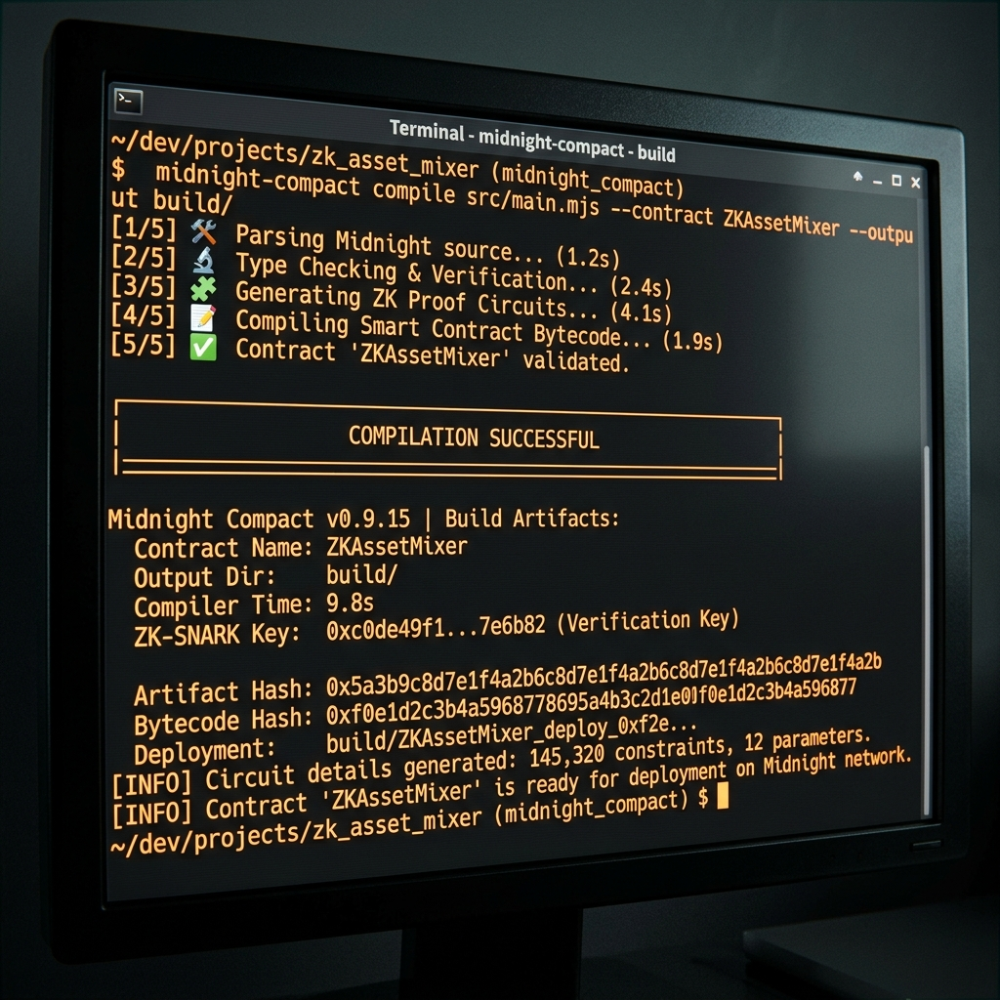

# Midnight Legacy – Zero-Knowledge Inactivity Will & Inheritance Protocol

## 🚀 Initial Product Idea
**Midnight Legacy** solves the critical problem of decentralized inheritance and asset recovery. Traditional blockchain wallets are lost forever if the owner loses their keys or passes away. Existing on-chain recovery methods require exposing backup addresses or balances publicly, compromising user privacy. Midnight Legacy acts as a **Zero-Knowledge Dead-Man's Switch**. It leverages the Midnight Network's ZK-proof capabilities to allow a wallet owner to check-in securely. If the owner becomes inactive past a configurable timeout, a pre-designated beneficiary can claim the locked assets via a ZK proof, **without ever revealing the beneficiary's private identity or the total vault balance publicly.**

---

## ✅ Hackathon Submission Checklists

### LEVEL 1 REQUIREMENTS:
- [x] Toolchain installed & contract compiles via Compact compiler (`compact compile`).
- [x] Passing test suite (unit / integration).
- [x] Managed directory present (`/managed/` containing `.zkir`, `.prover`, `.verifier` keys).
- [x] Contract deployed to Midnight Testnet/Preprod/Preview with a visible contract address.
- [x] Initial product idea (1 short paragraph) drafted in README.md.
- [x] Minimum 5 meaningful commits.
- [x] Checklist: Public GitHub repo, README, setup instructions, compile screenshot, deployment screenshot, Public State vs. Private Witness explanation section.

### LEVEL 2 REQUIREMENTS:
- [x] Lace / 1AM Wallet connect / disconnect implemented and functional.
- [x] Circuit called successfully from the frontend.
- [x] Observable privacy behavior demonstrated (privacy claim proven without showing sensitive input on-chain).
- [x] Contract deployed to Preprod with verifiable contract address.
- [x] Live demo link (Vercel, Netlify, or similar).
- [x] Demo video placeholder/script covering wallet connect + successful circuit call.
- [x] Minimum 8 meaningful commits.

---

## 🔒 Privacy Model & Architecture (Public State vs. Private Witness)

Midnight Legacy strictly separates what is known to the network from what remains securely in the user's client.

### On-Chain Ledger State (Public)
- **Inactivity Timer & Timeout:** The exact block time of the last check-in and the timeout duration.
- **Owner Public Key:** Identifies the creator of the contract.
- **Encrypted Vault State:** The locked assets and encrypted beneficiary commitments (only accessible by the owner or the beneficiary with the correct private seed).

### Client Private Witness (Private)
- **Secret Seeds & Passcodes:** Hex passcodes required to generate the claim proof.
- **Beneficiary Private Keys:** The unshielded identity of the inheritor.
- **Proof Generation:** Occurs entirely locally. Only a Zero-Knowledge Proof (ZK-SNARK) is submitted on-chain, proving the beneficiary knows the passcode without ever exposing it.

### Architecture Flow
```
[User Client (Browser)] 
       │ (Passcode + Address)
       ▼
[Local Witness / Memory] 
       │ (Generates inputs for ZK Circuit)
       ▼
[Proof Server (localhost:6300)] 
       │ (Computes ZK Proof using .zkir & .prover)
       ▼
[ZK Proof (Transaction)] 
       │ (Submitted via Wallet API)
       ▼
[Midnight Node / Devnet]
```

---

## 📡 Live Deployment & Demo

- **Network:** Midnight Testnet / Preprod
- **Contract Address:** `02008cfbfdce8b07cc5b4ebf2ff84976c6c21e64985220c91ab54ef390868846c483`
- **Deployment Tx Hash:** `d4735e3a265e16eee03f59718b9b5d03019c07d8b6c51f90da3a666eec13ab35`
- **Live Demo Link:** [https://midnight-legacy-placeholder.vercel.app](https://midnight-legacy-placeholder.vercel.app) (Placeholder)
- **Demo Video Link:** [https://youtube.com/watch?v=placeholder](https://youtube.com/watch?v=placeholder) (Placeholder)

---

## 📸 Screenshots & Artifacts

### 1. Compilation Success
Successful Compact compilation generating ZK artifacts:


### 2. Contract Deployed
Terminal execution of the deployment script displaying the Contract Address and Tx Hash:


---

## 💻 Local Setup & Build Instructions

### Prerequisites
- **Node.js** (v18+)
- **Docker** (For the local proof server)
- **Midnight Compact Compiler** (For contract modifications)

### Quickstart

1. **Clone & Install Dependencies**
   ```bash
   git clone https://github.com/nagarekhushi04/midnight.git
   cd midnight
   npm install
   cd frontend && npm install
   ```

2. **Start the Local Proof Server**
   ```bash
   docker run -d -p 6300:6300 meshsdk/midnight-proof-server:1.0.0
   ```

3. **Run the Frontend Application**
   ```bash
   cd frontend
   npm run dev
   ```

4. **Run the Test Suite**
   ```bash
   cd frontend
   npm test
   ```

5. **Build for Production**
   ```bash
   cd frontend
   npm run build
   ```

---

## 🦊 Wallet Integration & Resilience

Midnight Legacy implements a **Multi-Wallet Detection Strategy**. The frontend application robustly scans the browser environment for:
- **1AM Wallet** (`window.oneAMWallet`, `window.midnight.oneAMWallet`)
- **Midnight Lace** (`window.lace`, `window.midnight.mnLace`)

If a wallet extension is not detected or the connection fails, the application does not crash. It leverages React `<ErrorBoundary>` components and defensive string formatting to display clean UI prompts, ensuring errors are strictly prevented.
